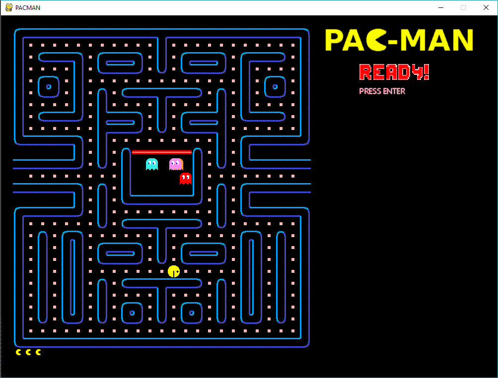
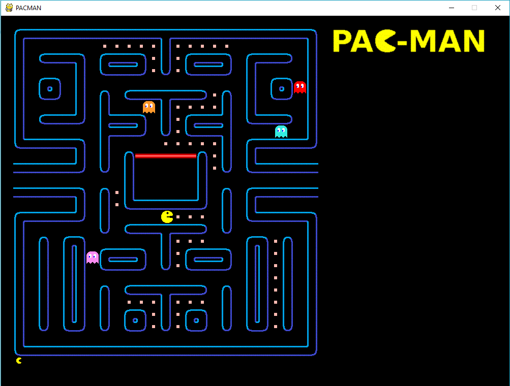

# The-Game

A playable game of Pacman.

# Language 
1. Python

# Packages Used
1. pygame
2. random
3. os
4. math
5. json

# How to use?

Open the Game.py file. Either directly or using command line -

             >\ py Game.py

Press Enter to start the game.

# Screenshots -

